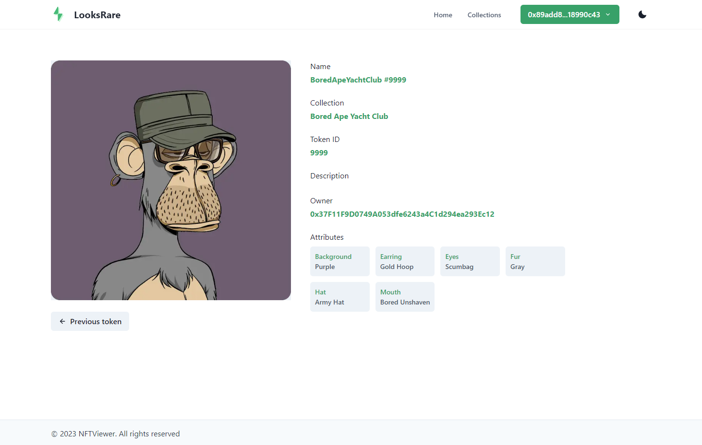

# LooksRare-NextApp-Wagmi-Tailwind-ChakraUI



## Implemented Features

1. Use Ethers.js, Next.js, React-Query, Chakra UI
2. Fetch data from LooksRare API v1.
3. Display the NFT's name, description, tokenId and image.
4. Have a button for the user to connect their wallet (supporting one connector is fine i.e. Metamask)
5. Check whether the connected wallet owns the NFT, and give the user a visual indication of whether the owner check is truthy or falsy.
6. Populate the query collection address and tokenId using url params.
7. Incoporate navigating to other NFTs within the same collection.
8. Fetch and display more information than we've given you above.
9. Display LooksRare ask orders
10. Add button to execute valid listing via the V1 exchange contract using `matchAskWithTakerBid`

## Getting Started

1. Install the app's dependencies:

```bash
yarn install
```

2. Run the local development server:

```bash
yarn dev
```

3. Open [http://localhost:3000](http://localhost:3000) with your browser to see the app in action
